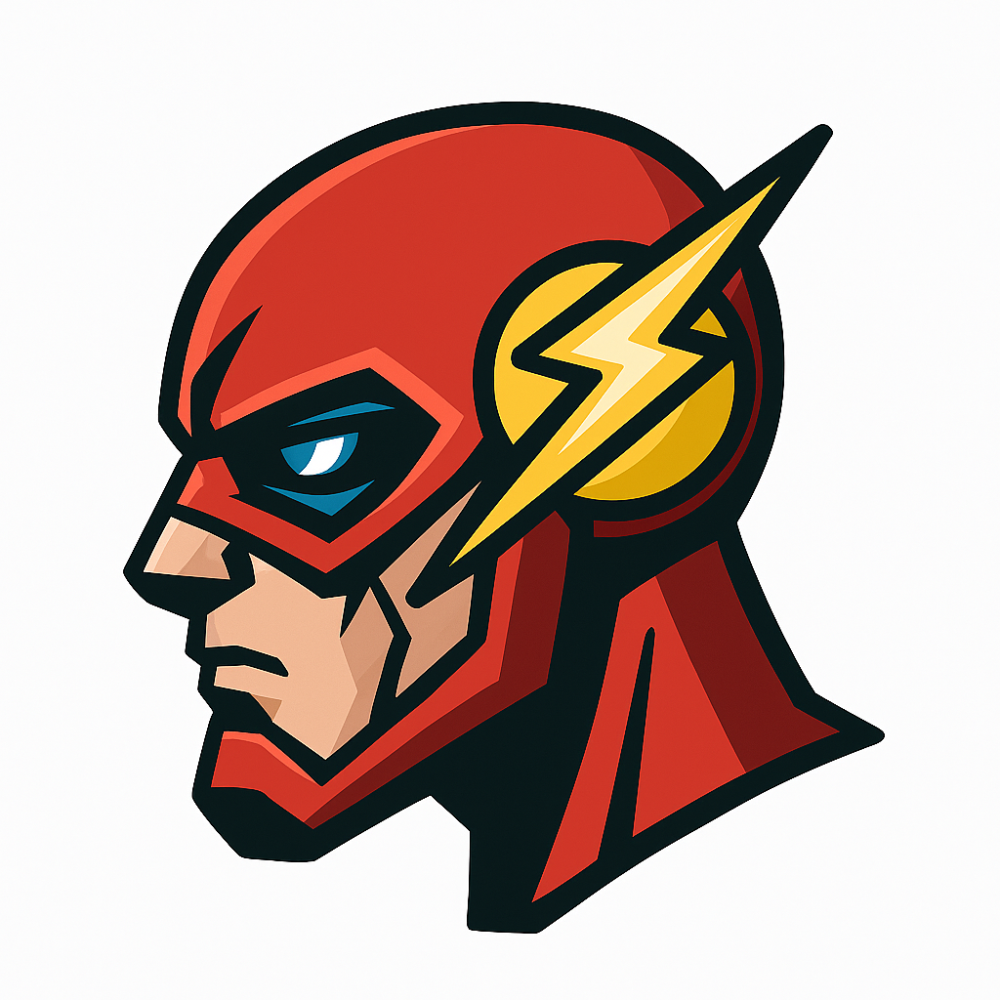

# ⚡ FlashSlide - All In One Use Chrome Extension

<p align="center">
  
</p>

FlashSlide is a productivity-focused Chrome Extension that combines smart automation with a quick-access side panel. Instantly interact with popular websites like Amazon Shopping Automation (Developed by Me) and quickly launch your favorite tools such as ChatGPT, Claude, YouTube, GitHub, and more, all from a sleek embedded sidebar.

## 👾 Project Demo 👾

#### **1 min quickDemo** : [FlashSlide Vd Demo](https://drive.google.com/file/d/1dSpZC_n0Ezxrmxcf5UMPsukgHuvrv0aI/view?usp=sharing)

https://github.com/user-attachments/assets/099c0c10-0207-4c64-a373-99d07d273e0d

## 🚀 Features

- 🔁 **Automated Button Clicking**  
  Auto-click the “Buy Now” button on Amazon product pages.

- 🧭 **Customizable Sidebar Panel**  
  Quickly open useful tools and resources including:

  - [Amazon Shopping Automation Developed By Me](https://github.com/flash-slide/amazon-scraping-to-automate-shopping)
  - MLH Fellowship and LMS
  - YouTube, Google Docs
  - ChatGPT, Claude, DeepSeek, Gemini, Meta AI
  - Telegram, WhatsApp, Notion, TikTok, GitHub, and more

- 📤 **Social Sharing via Context Menu**  
  Instantly share the extension using:

  - Email
  - X (Twitter)
  - Facebook
  - WhatsApp
  - LinkedIn
  - Telegram
  - VKontakte

- 🛠️ **Bypass Embedding Restrictions**  
  Uses `declarativeNetRequest` to remove restrictive headers like `x-frame-options` and `content-security-policy` for seamless iframe previews.

---

## 📦 Installation

1. **Clone the repository**:
   ```bash
   git clone https://github.com/your-username/flashslide.git
   cd flashslide
   ```

2 **Load the extension in Chrome:**

- Go to chrome://extensions/

- Enable Developer mode (top-right corner)

- Click Load unpacked

- Select the folder you just cloned

## 🧩 Usage

- Press Ctrl+B (or Cmd+B on Mac) to open the side panel.

- Click any icon in the sidebar to open it in the embedded iframe.

- To trigger Amazon automation programmatically:

```
window.postMessage({
  type: "START_AUTOMATION",
  productUrl: "https://www.amazon.com/dp/YOUR_PRODUCT_ID"
});

```

## 📁 Project Structure

```
.
├── background.js         # Handles context menu & automation triggers
├── content.js            # Auto-clicks "Buy Now" button on Amazon
├── panel.html            # Side panel interface
├── panel.js              # Sidebar logic and iframe control
├── style.css             # Custom sidebar & preview styling
├── manifest.json         # Chrome Extension manifest
├── removeHeader.json     # Removes headers blocking iframe
├── logos/                # Sidebar tool icons
├── technical-concept-img # Image for technical concept
└── technical-concepts-read.md # Explains technical concept

```
