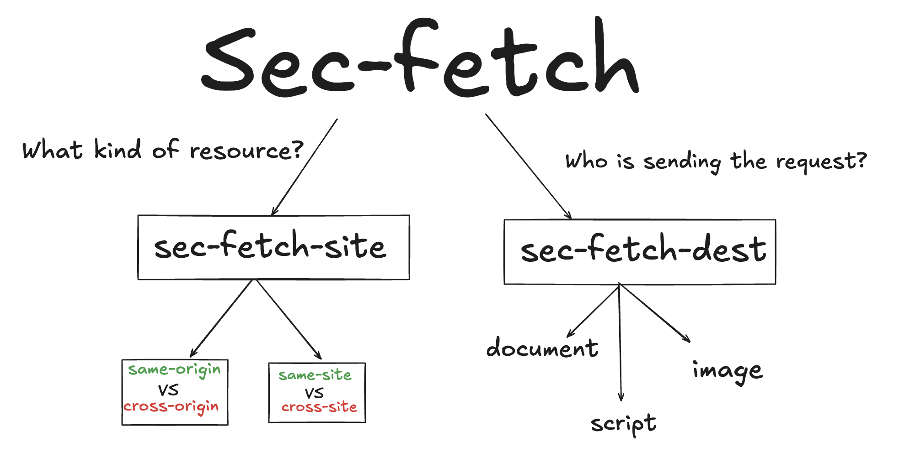

# Sec-fetch

### Basically, there are two types of sec-fetch, sec-fetch-dest & sec-fetch-site



- sec-fetch-site (Where is the request coming from?/Who is sending the request?)
- sec-fetch-dest (What kind of resource?)

## Use case 🤝

Imagine you’re logged in to your online bank at https://bank.com. Your browser stores a session cookie so the bank knows it’s you on every request.
Now, a hacker tricks you into visiting https://evil.com (e.g., by email, ad, or malicious link).

On that evil site, they embed this

```
// The browser automatically loads the image. That's normal behavior.
// This could be done by email, ad, or malicious link

```

```
// what if hacker
GET /transfer?amount=10000&to=hacker
Host: bank.com
Sec-Fetch-Site: cross-site           ❌ Not from original host
Sec-Fetch-Mode: no-cors              ❌ No rules
Sec-Fetch-Dest: image                ❌ Red flag, req image

// what if real user
GET /transfer?amount=10000&to=savings
Host: bank.com
Sec-Fetch-Site: same-origin          ✅ Comes from same origin (bank.com)
Sec-Fetch-Mode: navigate             ✅ It's a real page navigation
Sec-Fetch-Dest: document             ✅ Means full page load

// The 1st one is an example of hacker trying to access to back tranfer route from different site which is blocked by host since being **cross-site**
```

💡 Sec-Fetch-Site: cross-site is the key : It tells bank.com: “This request did not originate from a page hosted on bank.com, it came from a different origin, like evil.com.”

## Why this works ✅

- In the past, browsers did not include this context, so servers couldn’t tell who was behind the request.
- Now with headers like Sec-Fetch-Site, Origin, and Referer, the server can say: "I'm only going to process requests that come from my own site (same-origin) or subdomains (same-site), not cross-site attackers."

## For more detail about how rules are set for original and cross

Refer to this link : https://web.dev/articles/same-site-same-origin#same-origin-and-cross-origin
